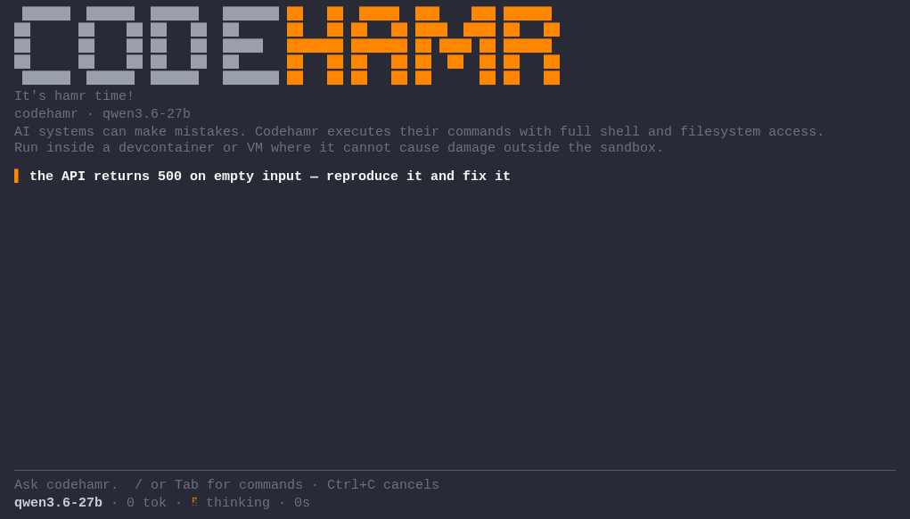

# jimmyhamr

A minimal coding agent for the terminal. Built for local LLMs, also
runs on OpenAI-compatible endpoints.



This is a fork of [codehamr/codehamr](https://github.com/codehamr/codehamr) with personal touch-ups and tweaks. The original project remains the upstream reference for full docs, config details, hardware recommendations, and more — this repo just ships my preferred defaults on top.

## Differences from upstream

| Change | This fork (`jbramnick/codehamr`) | Upstream (`codehamr/codehamr`) |
|---|---|---|
| **Name** | `jimmyhamr` — config lives in `.jimmyhamr/`, module path is `github.com/jbramnick/codehamr` | `codehamr` — config lives in `.codehamr/`, module path is `github.com/codehamr/codehamr` |
| **Cursor focus** | Cursor blink follows terminal focus: visible on focus, hidden on blur (`FocusMsg` → re-focus textarea, `BlurMsg` → blur it) | Focus/blur events are swallowed entirely to prevent escape fragments leaking into the prompt — cursor stays whatever state it was in |
| **HamrPass** | Removed. No HamrPass profile or config section is seeded on first run | Optional paid endpoint (`hamrpass`) seeded alongside `local` and `openai` profiles; waitlist at codehamr.com |
| **Import / Export** | Two new slash commands: `/export` writes the full conversation to `hamr_session_export.md`, `/import` loads it back into context and deletes the file. Useful for pausing a session and resuming later in a fresh run | Not available — no built-in way to persist and reload a conversation outside of chat history |

## Install

Linux, macOS:

```bash
curl -fsSL https://raw.githubusercontent.com/jbramnick/codehamr/main/install.sh | bash
```

Windows:

```cmd
curl -fsSL https://raw.githubusercontent.com/jbramnick/codehamr/main/install.cmd -o install.cmd && install.cmd
```

> **Windows note:** codehamr's `bash` tool needs a POSIX shell (`/bin/sh`), so on Windows run it inside WSL2 or a devcontainer, not from a bare `cmd`/PowerShell host.

Then run `jimmyhamr` in your project.

> **Warning:** AI systems like codehamr run model-generated shell commands with full filesystem access. Best run inside safe sandboxes like devcontainers or isolated VMs.

> **Windows + devcontainer:** When you run the VS Code devcontainer on Windows, enable Docker Desktop's WSL integration for your distro (Settings, Resources, WSL integration, toggle on the Debian distro). Without it the container cannot reach the Docker engine through WSL2.

## Config

On first run jimmyhamr seeds `.jimmyhamr/config.yaml` with a `local`
(Ollama, vLLM, LM-Studio) profile. The system prompt is embedded
in the binary, not on disk. Project specific rules go straight into the
chat: tell the agent what matters, the conversation carries it.

Any OpenAI-compatible endpoint works too. The example below adds an
`openai` profile:

```yaml
# jimmyhamr configuration
#
# Running jimmyhamr in a devcontainer / WSL2 with Ollama on the host:
# swap 'http://localhost:11434' with 'http://host.docker.internal:11434' below.

active: local
models:
    local:
        llm: qwen3.6:27b
        url: http://localhost:11434
        key: ""
        context_size: 256000
    openai:
        llm: gpt-5.5
        url: https://api.openai.com
        key: sk-...
        context_size: 128000
```

`/models` lists profiles, `/models <name>` switches.

## Hardware

Local LLMs finally caught up, and we love it. For the best experience we recommend a **~30B-class** model on **32 GB+ unified RAM / VRAM**, fully local and a real alternative to expensive cloud subscriptions.

Info for Ollama users: Ollama's `/v1` endpoint reports no context-window header, so jimmyhamr packs blind to `context_size` in your config. If that exceeds what your server honors, Ollama silently front-truncates the prompt, and jimmyhamr loses its system prompt and earlier tool results mid-task with no error. Ollama Desktop may cap context at 4k: open settings, lift the **Context length** slider to **64k+** (RAM / VRAM permitting), and raise `context_size` in `.jimmyhamr/config.yaml` to match. The seeded default is a safe 32k.

Sampling matters too: for coding, a ~30B-class model typically wants `temperature 0.6`, `top_p 0.95`, `top_k 20`, and **never greedy decoding** (temp 0), which sends it into endless repetition loops. If it still loops, add a small `presence_penalty` and check your server actually applies it (current Ollama silently ignores penalty params). These are server-side knobs, set them at your endpoint.

If the model prints tool calls as text instead of acting, enable your server's tool-call parser; jimmyhamr warns you when that happens.

## Give the agent a runtime

jimmyhamr verifies by running things, so give its sandbox the toolchains your project needs. It bootstraps small verify helpers itself when the box allows (a headless browser, a linter), but won't provision your project's own toolchain. If a check can't run, it reports `unverified:` instead of pretending.

## Compare

| Tool | Pick if |
|---|---|
| **Frontier** | you want commercial heavyweight polish from Claude Code or Codex and accept the subscription cost and session timeouts |
| **[opencode](https://github.com/anomalyco/opencode)** | you want a great, loaded Swiss army knife and embrace plugin complexity |
| **[pi](https://github.com/earendil-works/pi)** | you want something lighter than opencode and accept configuring your own extensions, skills, and themes |
| **jimmyhamr** | you want the lightest take with cursor focus tracking and session import/export — simplicity over complexity |

## License

[MIT](LICENSE). Do whatever you want with it.
